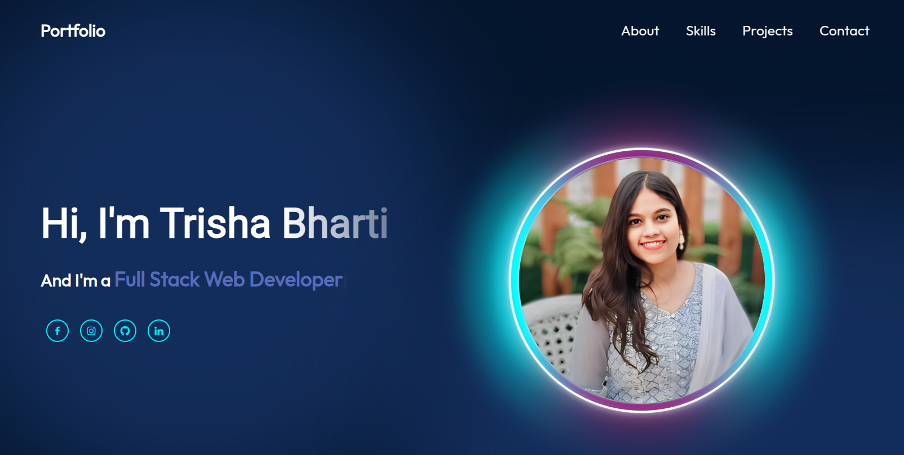

This project is my personal portfolio built with React and Vite, designed to showcase my creativity, technical skills, and experience in web development.
It features an interactive, animated, and visually engaging interface to leave a lasting impression.

Features
Vite: Fast and modern build tool for lightning-fast development.
React: The robust JavaScript library for building user interfaces.
Axios: Simplified HTTP requests for fetching and displaying data dynamically.
CSS: Customized styles to deliver an aesthetic and responsive design.

Highlights
Minimal yet elegant design to emphasize creativity and professionalism.
Interactive elements that create a dynamic user experience.
Fully responsive layout that adapts seamlessly to all screen sizes.

[Portfolio Link](https://portfolio-three-opal-79.vercel.app/)

